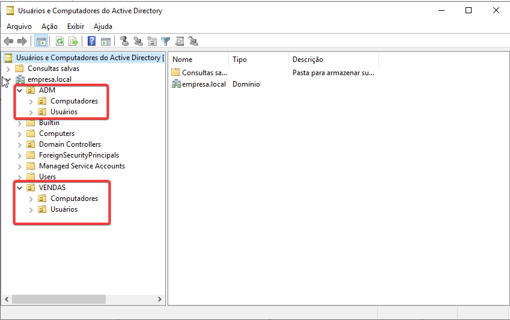

# Configurações

FQDN - empresa.local  
IP Domain controler - 192.168.100.10  
IP Workstation_01 - 192.168.100.50  

# Active Directory e Políticas de Grupo

## Unidades Organizacionais

### VENDAS
### ADM

#### As OU deverão conter os users e as workstations de cada respetiva unidade

## Criação de usuários

### OU ADM  
Luca Gil  
João Almeida

### OU VENDAS  
Sara Almeida  
Noémia Figueiredo

